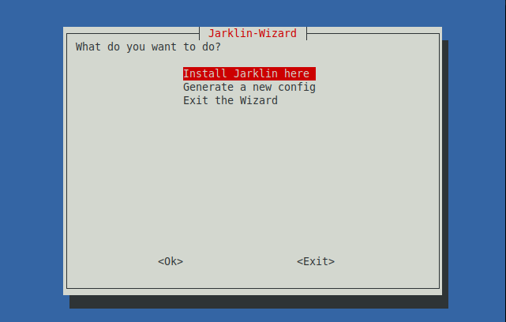
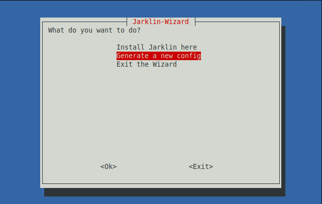

# Quick Start

## Setup

First we will install the dependencies.

- ffmpeg is needed by the Jarklin server to process videos
- curl is used to download the wizard and by the wizard to download additional assets
- whiptail is used by the wizard as the UI

```bash
sudo apt install ffmpeg curl whiptail
```

::: warning
Depending on you linux distro you might have a different package-manager than `apt` or the packages have different names.
Before installation make sure that this command is correct.
:::

::: warning
depending on the distro whiptail may be available through the `newt` package.
:::

## Installation

First you should go into the directory you want to install Jarklin into.
The recommended directory is `/opt/`.

```bash
cd /opt/
```

To use the latest version of the wizard run the following command:

```bash
curl -Ls https://github.com/jarklin/jarklin/raw/main/scripts/wizard.sh | bash
```

This will start the UI. Here you can select what the wizard should do.

Select `Install Jarklin here` and press `<return>`.



Now to the features you want to install.
Toggle them with `<space>`.
If you have selected what you want to install you can press `<return>`.


After the installation you can exit the wizard.

## Configuration

Go into the directory of the media you want Jarklin to serve.

```bash
cd /path/to/media/
```

After that you can start the wizard again.

```bash
curl -Ls https://github.com/jarklin/jarklin/raw/main/scripts/wizard.sh | bash
```

Select `Generate a new config` and press `<return>`.



This should ask you step by step on how you want Jarklin to be configured and will generate a custom configuration file.

## Cache generation and Server starting

Stay in the directory where your media and the configuration file is located.

With the following command you can generate the cache:

```bash
/opt/jarklin/jarklin cache generate
```

This process will take, depending on your media, between a few minutes or a few hours.

Be patient for this step.
This is unavoidable but luckily only has to be done once.

After the cache is done generating, you can start the web-server.

```bash
/opt/jarklin/jarklin web run
```

If you haven't changed the port you should be able to visit http://localhost:9898/ and see your media.

After the verification, that Jarklin works you can press `ctrl+c` to stop the server.

## Persistence

But you don't want to keep a terminal open in order to serve your media.
For that purpose we will create a service.

Write the following service configuration into `/etc/systemd/system/jarklin.service`.
(Adjust the content to your needs)

```service
// todo
```

After that we will tell systemctl to search for new/changed `.service` files,
enable auto-start of Jarklin after reboot and to start Jarklin.

```bash
sudo systemctl daemon-reload
sudo systemctl enable jarklin.service
sudo systemctl start jarklin.service
```

::: tip
If you don't want to create the service as root, but instead the current user,
you can create the `.service` file in `~/.config/systemd/user/` and add `--user` to the `systemctl` commands.
:::
